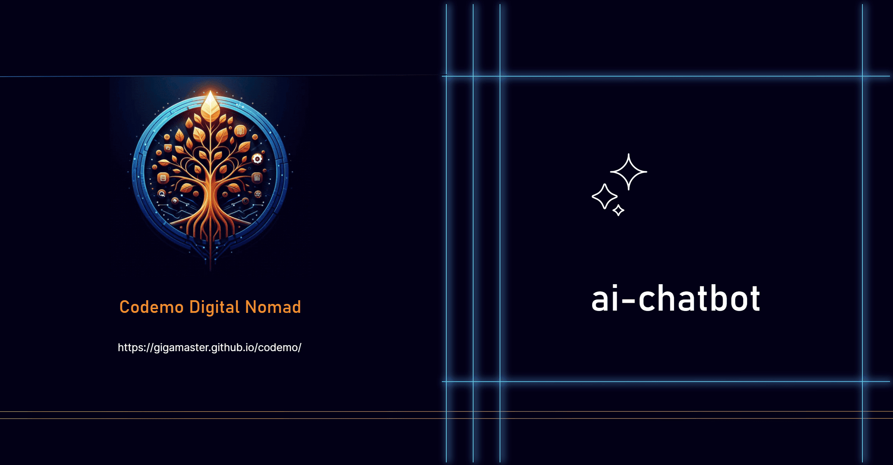

<a href="https://github.com/gigamaster/ai-chatbot">
  
  <h1 align="center">AI Chatbot for Codemo Digital Nomad</h1>
</a>

<p align="center">
  An AI-Chatbot - Part of the <a href="https://github.com/gigamaster/codemo">Codemo</a> suite of tools for Digital Nomads
</p>

<p align="center">
  <a href="https://github.com/gigamaster/ai-chatbot"><strong>GitHub Repository</strong></a> ·
  <a href="#features"><strong>Features</strong></a> ·
  <a href="#model-providers"><strong>Model Providers</strong></a> ·
  <a href="#deploy-your-own"><strong>Deploy Your Own</strong></a> ·
  <a href="#running-locally"><strong>Running locally</strong></a>
</p>

Codemo provides a suite of open-source tools designed for digital nomads on GitHub, featuring an AI-powered chatbot that operates on free tiers, stores data locally, and adheres to European data privacy standards.

<p align="center">
  <a href="#features"><strong>Features</strong></a> ·
  <a href="#model-providers"><strong>Model Providers</strong></a> ·
  <a href="#deploy-your-own"><strong>Deploy Your Own</strong></a> ·
  <a href="#running-locally"><strong>Running locally</strong></a>
</p>
<br/>

## Features

- [Next.js](https://nextjs.org) App Router
  - Advanced routing for seamless navigation and performance
  - React Components (RSCs) and Actions for client-side
- AI Generic
  - Unified API for generating code, debugging, and technical explanations
  - Hooks for building dynamic code collaboration interfaces
  - Supports multiple AI models optimized for code understanding
- [shadcn/ui](https://ui.shadcn.com)
  - Styling with [Tailwind CSS](https://tailwindcss.com)
  - Component primitives from [Radix UI](https://radix-ui.com) for accessibility and flexibility
- Code Collaboration Features
  - Real-time code editing with [CodeMirror](https://codemirror.net/)
  - Syntax highlighting for multiple programming languages
  - Code execution and debugging capabilities
- Data Persistence
  - Data Persistence
  - Local database for saving chat history and user data
  - Local storage for efficient data privacy
  - Simple and secure authentication with lock option

## Model Providers

Codemo AI-chatbot uses an AI Gateway to access multiple AI models optimized for code understanding through a unified interface. The default configuration includes models with free tiers.

### AI Gateway Authentication

You need to provide an AI Gateway API key by setting the provider `API_KEY` and endpoint URL `baseUrl`.  This ensures that the AI Gateway can authenticate and connect to the appropriate services.

**Optional**  

You can also switch to direct LLM providers like [OpenAI Codex](https://openai.com/blog/openai-codex), [Anthropic Claude Code](https://anthropic.com), and [other code-optimized models](https://ai-sdk.dev/providers/ai-sdk-providers) with just a few lines of code.

## Running locally

You will need to use pnpm:

1. Install the required dependencies: `pnpm install`
2. Run the development server: `pnpm dev`

```
pnpm install
pnpm dev
```

AI-chatbot should now be running on [localhost:3000](http://localhost:3000).

## How to Use

### Locking the Application

Codemo AI-chatbot includes a security feature that allows you to lock the application to protect your data on shared computers:

1. **Set up a password**:
   - Open the user menu by clicking on your user avatar in the sidebar
   - You'll need to log in or create an account first
   - When the lock screen appears, enter a new password to set it up

2. **Lock the application**:
   - Once a password is set, you can lock the application in two ways:
     - Click the lock icon button in the header (top right corner)
     - Use the "Lock Now" option in the user menu
   - The application will immediately lock and display the lock screen

3. **Unlock the application**:
   - Enter your password on the lock screen to unlock the application
   - Press Enter or click the "Unlock" button to proceed

### Using Developer Tools

Codemo AI-chatbot provides access to additional developer tools through the tools menu:

1. Click the code icon in the header
2. Choose from the available tools:
   - **Live Code Editor**: Opens an interactive coding environment
   - **Codemo Digital Nomad**: Access tools designed for digital nomads

Both tools open in a new browser tab for your convenience.

### Code Collaboration Features

- Use the chat interface to discuss code with the AI assistant
- Create and edit code artifacts directly in the chat
- Execute code snippets to test functionality
- Export chats as JSON, Markdown, or text files for sharing
- Collaborate with team members through shared chats (when implemented)
